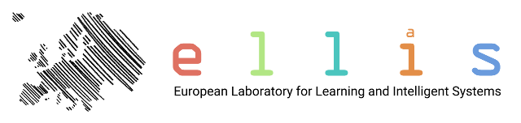

# Ellis QPhML 2020

The aim of the Ellis program Quantum and Physics based machine learning ([**QPhML**](ellisfellows.md)) is to use concepts from Quantum Physics and Statistical Physics to develop novel machine learning algorithms with the ultimate aim to realize novel future, possibly energy efficient, hardware implementations.

The program is part of the recent European initiative called [**ELLIS**](https://ellis.eu/) (European Laboratory for Learning and Intelligent Systems) to stimulate research on machine learning by building networks of top reseach groups in Europe. 

Learn more [here](ellisfellows.md)

# Speakers 

### Statistical Physics of Machine Learning 

**Florent Krzakala** [[web](https://florentkrzakala.com/), [scholar](https://scholar.google.com/citations?user=3jDeUlMAAAAJ&hl=en)]: _TBA_

***

**Florian Marquardt** [[web](http://www.thp2.nat.uni-erlangen.de/index.php/Homepage_Florian_Marquardt), [scholar](https://scholar.google.com/citations?user=jx_c7SgAAAAJ&hl=en)]: _"Self-learning machines based on nonlinear field evolution"_

***

**Carlo Baldassi** [[scholar](https://scholar.google.com/citations?user=DYUloYkAAAAJ&hl=it)]: _TBA_

***

**Ton Coolen** [[web](https://toncoolen.wixsite.com/accc), [scholar](https://scholar.google.co.uk/citations?user=yJb0-aIAAAAJ&hl=en)]: _"Replica analysis of overfitting in generalized linear regression models"_

### Quantum ideas for Machine Learning 

**Jens Eisert** [[web](https://www.physik.fu-berlin.de/en/einrichtungen/ag/ag-eisert/people/eisert/index.html), [scholar](https://scholar.google.com/citations?user=WawCci0AAAAJ&hl=en)]: _"Probabilistic Modelling with Tensor Networks - A Bridge from Graphical Models to Quantum Circuits"_

***

**Aram Harrow** [[web](http://web.mit.edu/aram/www/), [scholar](https://scholar.google.com/citations?user=6WYsaqMAAAAJ&hl=en)]: _"Small quantum computers and big classical data sets"_

***

**Manfred Opper** [[web](https://dblp.uni-trier.de/pers/o/Opper:Manfred.html)]: _TBA_

***

**Andrea Rocchetto** [[web](https://andrearocchetto.github.io/), [scholar](https://scholar.google.com/citations?user=E5AvzjAAAAAJ&hl=en)]: _"No exponential speedups for practical quantum machine learning algorithms"_

***

**Vedran Dunjko** [[web](https://www.universiteitleiden.nl/en/staffmembers/vedran-dunjko#tab-1), [scholar](https://scholar.google.com/citations?user=syyWEfIAAAAJ&hl=de)]: _"Quantum algorithms for reinforcement learning"_

***

**Eduardo Dominguez** [[scholar](https://scholar.google.at/citations?user=hfNetG8AAAAJ&hl=en)]: _"Quantum approximate inference through message passing (tentative title)"_

***

**Christian Gogolin** [[web](http://www.cgogolin.de/), [scholar](https://scholar.google.com/citations?user=8sE9_B8AAAAJ&hl=en)]: _"Quantum many-body systems - understanding them with and using them as new machine learning tools"_

***

**Masuyuki Ohzeki** [[scholar](https://scholar.google.com/citations?user=BTwzDDwAAAAJ&hl=en)]: _"Quantum annealing and machine learning - learning and Black-box optimization"_

***

**Laurent Daudet** [[web](https://www.institut-langevin.espci.fr/laurent_daudet?lang=fr), [scholar](https://scholar.google.com/citations?user=PCIAcfUAAAAJ&hl=en)]: _"Mix and Match: leveraging optically-created random embeddings in Machine Learning pipelines"_

***

**Hussein Sadeghi** [[scholar](https://scholar.google.com/citations?hl=en&user=piDNXW4AAAAJ&view_op=list_works&sortby=pubdate)]: _TBA_

***

**Volker Tresp** [[web](https://www.dbs.ifi.lmu.de/~tresp/), [scholar](https://scholar.google.com/citations?user=xIJHTUwAAAAJ&hl=en)]: _"Quantum Machine Learning Algorithms for Knowledge Graphs"_

***

**Max Welling** [[web](https://staff.fnwi.uva.nl/m.welling/), [scholar](https://scholar.google.com/citations?user=8200InoAAAAJ&hl=en)]: _"Quantum Deformed Binary Neural Networks"_

### Machine Learning in Complex Systems 

**Gabor Csanyi** [[web](http://www.eng.cam.ac.uk/profiles/gc121), [scholar](https://scholar.google.com/citations?user=q39javYAAAAJ&hl=en)]: _"Machine learning the quantum mechanics of materials and molecules"_

***

**Luca Biferale** [[web](http://people.fisica.uniroma2.it/~biferale/), [scholar](https://scholar.google.it/citations?user=AqNnuK0AAAAJ&hl=it)]: _"Equation informed and data-driven tools for data-assimilation and data-classification of turbulent flows"_

***

**Antonio Celani** [[scholar](https://scholar.google.fr/citations?user=a5JvBbgAAAAJ&hl=fr)]: _TBA (physics view of biology)_

***

**Michele Ceriotti** [[web](https://people.epfl.ch/michele.ceriotti?lang=en), [scholar](https://scholar.google.com/citations?user=exWw7d0AAAAJ&hl=en)]:	_TBA (Machine learning for molecular dynamics, quantum physics)_

### Machine Learning for Quantum Physics

**Glen Mbeng** [[scholar](https://scholar.google.com/citations?user=9cBUERoAAAAJ&hl=en)]: _"Reinforcement Learning assisted Quantum Optimization"_

***

**Giuseppe Carleo** [[web](https://www.simonsfoundation.org/team/giuseppe-carleo/), [scholar](https://scholar.google.it/citations?user=e9I38PEAAAAJ&hl=it)]: _"Generative and variational modeling for interacting quantum systems"_

***

**Hans Briegel** [[scholar](https://scholar.google.at/citations?user=CtRLfr4AAAAJ&hl=de)]: _"Reinforcement learning and AI for quantum experiment"_

***

**Christopher Sutton** [[scholar](https://scholar.google.com/citations?user=pU6K6F8AAAAJ&hl=en)]: _"Assessing machine learning model reliability"_

***

**Leonard Wossnig** [[web](https://sites.google.com/view/leonardwossnig/), [scholar](https://scholar.google.com/citations?user=OAwZ1y4AAAAJ&hl=en)]: _TBA (Machine learning for quantum chemistry)_

***

**Alexandre Tkatchenko** [[web](https://wwwfr.uni.lu/recherche/fstm/dphyms/people/alexandre_tkatchenko), [scholar](https://scholar.google.com/citations?user=o2t1Pv8AAAAJ&hl=en)]: _"Unifying Quantum Chemistry and Machine Learning"_

***

**Anatole von Lilienfeld** [[web](https://www.chemie1.unibas.ch/~anatole/index.html), [scholar](https://scholar.google.com/citations?user=LFFk3rkAAAAJ&hl=en)]: _"Quantum Machine Learning in Chemical Compound Space"_

# Program 

### Day one (06-07-2020)

| Time          | Talk      | Link     |
| ------------- | ------------- | -----:|
| 09:00      | **Jens Eisert**: _"Probabilistic Modelling with Tensor Networks - A Bridge from Graphical Models to Quantum Circuits"_ | [[video](), [paper]()] |
| 09:45      | **Glen Mbeng**: _"Reinforcement Learning assisted Quantum Optimization"_     |   [[video](), [paper]()] |
| 10:30 | **Alexandre Tkatchenko**: _"Unifying Quantum Chemistry and Machine Learning"_      |   [[video](), [paper]()] |

### Day two  (07-07-2020)

| Time          | Talk      | Link     |
| ------------- | ------------- | -----:|
| 09:00      | **Jens Eisert**: _"Probabilistic Modelling with Tensor Networks - A Bridge from Graphical Models to Quantum Circuits"_ | [[video](), [paper]()] |
| 09:45      | **Glen Mbeng**: _"Reinforcement Learning assisted Quantum Optimization"_     |  [[video](), [paper]()] |
| 10:30 | **Alexandre Tkatchenko**: _"Unifying Quantum Chemistry and Machine Learning"_      |   [[video](), [paper]()] |

### Day three  (08-07-2020)

| Time          | Talk      | Link     |
| ------------- | ------------- | -----:|
| 09:00      | **Jens Eisert**: _"Probabilistic Modelling with Tensor Networks - A Bridge from Graphical Models to Quantum Circuits"_ | [[video](), [paper]()] |
| 09:45      | **Glen Mbeng**: _"Reinforcement Learning assisted Quantum Optimization"_     |  [[video](), [paper]()] |
| 10:30 | **Alexandre Tkatchenko**: _"Unifying Quantum Chemistry and Machine Learning"_      |   [[video](), [paper]()] |

# Organizers

**Bert Kappen** [[web](http://www.snn.ru.nl/~bertk/)]

**Riccardo Zecchina** [[web](https://sites.google.com/view/riccardozecchina/home)]

**???** [[web]()]
