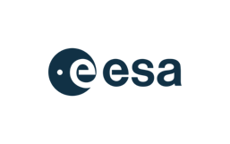
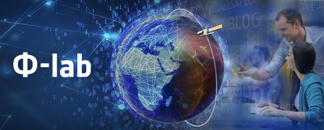

# Ellis-ESA Workshop 2021

> The workshop was held online. The videos of the talks can be found [**here**](https://youtube.com/playlist?list=PLCG8d74dLVO9ypUTaR7zSJatzFs37wyOg)

The Ellis program Quantum and Physics based machine learning ([**QPhML**](https://ellisqphml.github.io/)) is part of the recent European initiative called [**ELLIS**](https://ellis.eu/) (European Laboratory for Learning and Intelligent Systems) to stimulate research on machine learning by building networks of top research groups in Europe.

Learn more: [[Ellis initiative](https://ellis.eu/), [Ellis Fellows QPhML Program](https://ellisqphml.github.io/)]

 

The [**ESA**](http://www.esa.int/) [**&Phi;-lab**](https://philab.phi.esa.int/) is a catalyst for Earth Observation innovative and transformative ideas, and a bridge within Earth Observation’s ecosystem of innovative players which connects the actors of Industry, Investors, and Academia to foster entrepreneurial initiatives.

Learn more: [[ESA](http://www.esa.int/), [&Phi;-lab](https://philab.phi.esa.int/)]

# Aims and Scope

Quantum Computing has the potential of revolutionising information processing and becoming a key-enabler for yet unsolved technological and scientific problems. Recent advances in quantum physics and quantum algorithms make this game-changing turn even more likely.

Quantum computers will redefine parallel and probabilistic computing, and thus will allow to make complex computations in a considerably reduced time. In terms of data analytics, they will enable us to sample and explore huge volumes of scattered data, to identify and retrieve specific patterns, and optimize functionals for all kinds of use-cases. In terms of physics simulation, they will enable solving partial differential equations with applications to e.g. fluid dynamics. Today, thanks to progress in Noisy Intermediate-Scale Quantum (NISQ) devices and classical-quantum hybrid computing, promising approaches are already tested on real machines.

Earth Observation (EO) allows gathering of global information about our planet Earth’s physical, chemical and biological systems via satellites carrying remote sensing devices. The most recurrent issue in EO science is the solution of inverse, ill-conditioned problems, which typically include specific land-cover identification, biophysical parameter estimation and feature extraction, atmospheric inverse problems, gravimetry, etc. EO needs the unprecedented power of Quantum Computing to face current challenges in processing of Earth system measurements and data.

# Participation

Participation in the workshop is open to everyone in the limit of technical capacities. Registration by filling this form: [[**Registration**](https://forms.gle/4V2wMYk8AVdN6ehq8)]

# Program

Below you find the tentative program of the workshop. There will be a public workshop from 1pm to 5pm with keynote talks, and a closed post-workshop debriefing roundtable from 5pm to 7pm.
> Please note that all times are Central European Times (CET)

## May, 27th 2021

### Workshop with keynote talks (Public)

| Time          | Talk      | Link     |
| ------------- | --------- | --------:|
| 13:00 | [**Workshop Organizers**]():   _"Workshop opening talk"_     |   [[video](https://youtu.be/ZeLSwHh-SPs)] |
| 13:15 | [**Pan Zhang**](http://home.itp.ac.cn/~panzhang/) (Institute of Theoretical Physics, Chinese Academy of Sciences - CN):   _"Computation with Tensor Networks"_ | [[video](https://youtu.be/ZLaOfJQ1hdI), [slides](https://ellisqphml.github.io/ellis_esa2021_slides/01-Pan-Zhang-Tensor-Networks.pdf), [abstract and bio](https://ellisqphml.github.io/ellisphilab2021_abstract_and_bio#computation-with-tensor-networks-pan-zhang)] |
| 13:45 | [**Paolo Gamba**](http://tlclab.unipv.it/index.php/people/the-team/23-people/71-paolo-gamba) (Univ. Pavia - IT):   _"Fusion, exploration and unmixing of EO data: challenges and perspectives"_     |   [[video](https://youtu.be/2ihk6Ai5Jo0), [slides](https://ellisqphml.github.io/ellis_esa2021_slides/02-Paolo-Gamba-QC.pdf), [abstract and bio](https://ellisqphml.github.io/ellisphilab2021_abstract_and_bio#fusion-exploration-and-unmixing-of-eo-data-challenges-and-perspectives-paolo-gamba)] |
| 14:15 | [**Vlatko Vedral**](https://www2.physics.ox.ac.uk/contacts/people/vedral) (Univ. Oxford - UK):   _"The current state of quantum computing"_      |   [[video](https://youtu.be/iwfvRVwB9k8), [slides](https://ellisqphml.github.io/ellis_esa2021_slides/03-Vlatko-Vedral-ESA-presentation.pdf), [abstract and bio](https://ellisqphml.github.io/ellisphilab2021_abstract_and_bio#the-current-state-of-quantum-computing-vedral-vlatko)] |
| 14:45 | **10 Minutes Breakout Session**  |    |
| 14:55 | [**Iordanis Kerenidis**](https://www.irif.fr/~jkeren/jkeren/Iordanis_Kerenidis.html) (QC Ware / CNRS - FR):   _"Towards quantum machine learning applications"_      |   [[video](https://youtu.be/qkvfVAPUzbo), [slides](https://ellisqphml.github.io/ellis_esa2021_slides/04-Iordanis-Kerenidis-ELLIS-QML.pdf), [abstract and bio](https://ellisqphml.github.io/ellisphilab2021_abstract_and_bio#towards-quantum-machine-learning-applications-iordanis-kerenidis)] |
| 15:25 | [**Luca Biferale**](http://people.fisica.uniroma2.it/~biferale/) (INFN, Univ. Rome “Tor Vergata” - IT):   _"Machine Learning tools for PDEs and PDEs tools for Machine Learning"_      |   [[video](https://youtu.be/tF60kf_JTDI), [slides](https://ellisqphml.github.io/ellis_esa2021_slides/05-Luca-Biferale-ESA-Ellis.pdf), [abstract and bio](https://ellisqphml.github.io/ellisphilab2021_abstract_and_bio#machine-learning-tools-for-pdes-and-pdes-tools-for-machine-learning-luca-biferale)] |
| 15:55 | [**Kristel Michielsen**](https://www.fz-juelich.de/SharedDocs/Personen/IAS/JSC/EN/staff/michielsen_k.html) (Jülich Supercomputing Centre and RWTH Aachen University - DE):   _"Quantum classical hybrid computing models in modular HPC systems with potential applications in Earth Observation"_      |   [[video](https://youtu.be/erAF1JmqXnk), [slides](https://ellisqphml.github.io/ellis_esa2021_slides/06-Kristel-Michielsen-Ellis-ESA-workshop_20210526.pdf), [abstract and bio](https://ellisqphml.github.io/ellisphilab2021_abstract_and_bio#quantum-classical-hybrid-computing-models-in-modular-hpc-systems-with-potential-applications-in-earth-observation-kristel-michielsen)] |
| 16:25 | [**Workshop Organizers**]():   _"Closing Address"_      |   [[video](https://youtu.be/kHnkoLfP098)] |
| 16:45 | **15 Minutes Breakout Session** |  |

### Debriefing Roundtable (Closed Session)

| Time          | Talk      |
| ------------- | --------- |
| 17:00 | **Panelists**:   _"Panel Discussion"_     |

# Organizers

**Bert Kappen** [[web](http://www.snn.ru.nl/~bertk/)]

**Riccardo Zecchina** [[web](https://sites.google.com/view/riccardozecchina/home)]

**Bertrand Le Saux** [[web](https://blesaux.github.io/)]

**Giuseppe Borghi** [[web](https://philab.phi.esa.int/)]

### Technical Chair

**James Wheeler**, **Andrzej Kucik** [[web](https://philab.phi.esa.int/our-people/)]

### Web Chair

**Gabriele Perugini** [[web](https://www.artlab.unibocconi.eu/wps/wcm/connect/cdr/artlab/home/people/students+and+postdocs/gabriele+perugini)]
